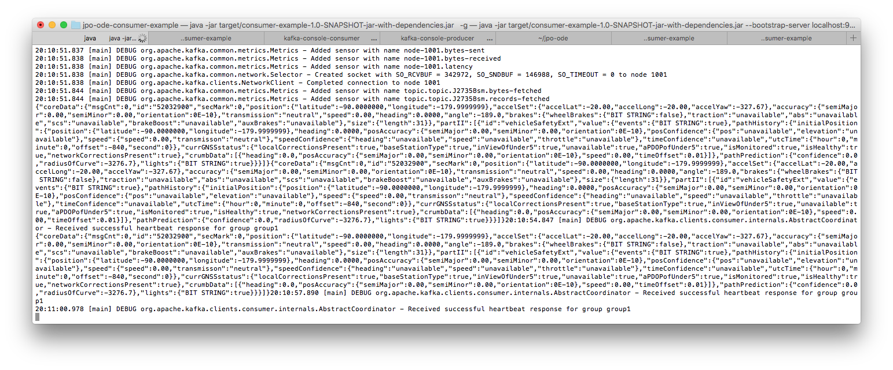

# AWS Deposit Service

This project is intended to serve as a  consumer application to subscribe to a Kafka topic of streaming JSON, package the results as a JSON file, and deposits the resulting file into a predetermined Firehose/Kinesis or S3 bucket. This runs alongside the ODE and when deployed using Docker Compose, runs in a Docker container.

## Quick Run
The use of AWS credentials is being read from the machine's environmental variables. You may also set them in your bash profile. Note that when using Docker Compose from the main `jpo-ode` repository, these variables are set in the `.env` present in that repo.

```
export K_AWS_ACCESS_KEY_ID = AccessKeyId
export K_AWS_SECRET_ACCESS_SECRET = SecretAccessKey
export K_AWS_SESSION_TOKEN = SessionToken
export K_AWS_EXPIRATION = Expiration
export API_ENDPOINT = <API_ENDPOINT>
export HEADER_ACCEPT = application/json
export HEADER_X_API_KEY = <HEADER_X_API_KEY>
```

The project needs to be compiled with assembly to ensure that that resulting jar is runnable with the Kafka libraries. It will produce a jar under `target/` with a "with-dependencies" tag.

```
mvn clean compile assembly:single install
```

To run the jar, be sure to include the topic at the end and group id at the end. If this is not a distributed system, the group can be any string.

```
java -jar target/jpo-aws-depositor-0.0.1-SNAPSHOT-jar-with-dependencies.jar   

usage: Consumer Example
 -s,--bootstrap-server <arg>   Endpoint ('ip:port')
 -d,--destination <arg>        Destination (Optional, defaults to Kinesis/Firehose, put "s3" to override) 
 -g,--group <arg>              Consumer Group
 -k,--key_name <arg>           Key Name
 -b,--bucket-name <arg>        Bucket Name
 -t,--topic <arg>              Topic Name
 -type,--type <arg>            string|byte message type
 -i, --k-aws-key <arg>    	AWS key name (Optional, defaults to AccessKeyId)
 -a, --k-aws-secret-key <arg>  AWS secret access key name (Optional, defaults to SecretAccessKey)
 -n, --k-aws-session-token <arg> AWS session token name (Optional, defaults to SessionToken)
 -e, --k-aws-expiration <arg>  AWS expiration name (Optional, defaults Expiration)
 -u, --token-endpoint <arg>    API token endpoint
 -h, --header-accept <arg>     Header Accept  (Optional, defaults to application/json)
 -x, --header-x-api-key <arg>  Header X API key
```
Example Usage As Of: 3/2/18

``` 
java -jar target/jpo-aws-depositor-0.0.1-SNAPSHOT-jar-with-dependencies.jar --bootstrap-server 192.168.1.1:9092 -g group1 -t topic.OdeTimJson -b test-bucket-name -k "bsm/ingest/bsm-"
```

It should return the following confirmation

```
DEBUG - Bucket name: test-usdot-its-cvpilot-wydot-bsm
DEBUG - Key name: bsm/ingest/wydot-bsm-
DEBUG - Kafka topic: topic.OdeBsmJson
DEBUG - Type: string
DEBUG - Destination: null

Subscribed to topic OdeTimJson 
```
Triggering an upload into the ODE, the output should be seen decoded into JSON in the console.



## Additional Resources

With the Kafka installed locally on a machine, here are a few additional commands that may be helpful while debugging Kafka topics.

[Kafka Install Instructions](https://www.cloudera.com/documentation/kafka/latest/topics/kafka_installing.html#concept_ngx_4l4_4r)

The IP used is the location of the Kafka endpoints.

#### Create, alter, list, and describe topics.

```
kafka-topics --zookeeper 192.168.1.151:2181 --list
sink1
t1
t2
```

#### Read data from a Kafka topic and write it to standard output. 

```
kafka-console-consumer --zookeeper 192.168.1.151:2181 --topic topic.J2735Bsm
```

#### Push data from standard output and write it into a Kafka topic. 

```
kafka-console-producer --broker-list 192.168.1.151:9092 --topic topic.J2735Bsm 
```
